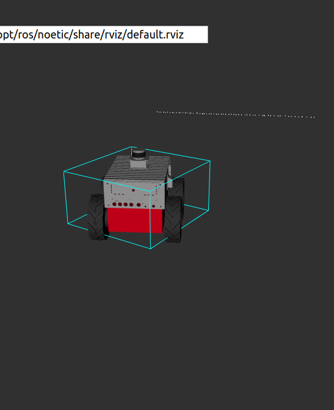
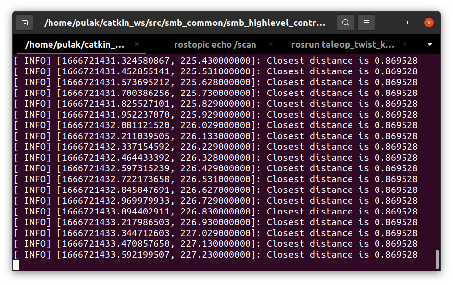

# Rviz Visualization

1. Created a subscriber `smb_highlevel_controller` node to the /scan topic. 

2. Programmed the callback method for that subscriber to output the smallest distance
measurement from the vector ranges in the message of the laser scanner to the
terminal.

3. Launched the simulation with roslaunch and inspect using Rviz

